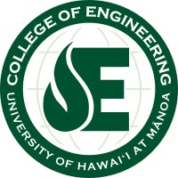

During the summer of 2016, I had the chance to attended an intership at the University of Hawai'i at Manoa for high school students interested in engineering. During my time there, I was part of a project consisting of UH professors and students whose goals included gathering information about generators that used ocean wave energy to produce power as well as building a smaller prototype to test in the field. This internship also allowed me to attend site tours to other engineering companies around Oahu. At the end of the intership, my partner and I presented to a group of sponsors as well as friends, family, and faculty what we did during our time in the internship.  

