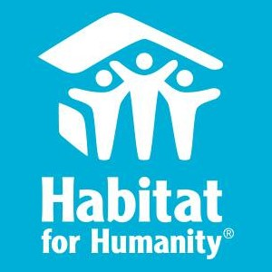

During my time in my high schools JROTC program, I was tasked with contacting, planning, and coordinating a community service project as part of one of my duties as a Company Commander.
I decided to choose Habitat for Humanity for my company's community service project due to having a contact who was working there. While there, my company was tasked with carrying and organizing furniture as well as helping customers with carrying out thier purchases.
This project gave each member of my company 10 hours of community survice. 
