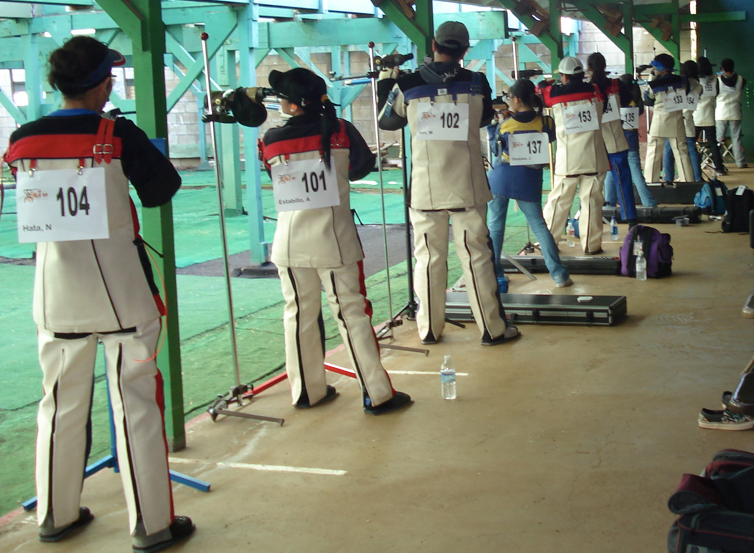

During my time in high school from 2013 to 2017, I was apart of my schools air rifle team since my freshmen year. This had me go to practice every evenning from 3pm to 6pm every weekday, attended competitions every saturday morning, and teach and lead new members as a varsity member and eventually team captain. Some responsiblities I had as team captain were to make sure everyone in the range was safely handling thier rifle as well as teach the basics of marksmanship to new members.
